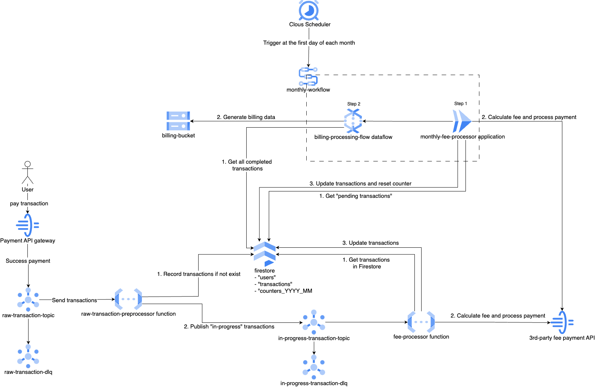

# Data Platform Exercise

## Objectives
- Design, develop a robust billing system that automates the recording of transaction fees and processes payments.
- Users are billed according to their subscription plan.

## Technical requirements
- Real time fee processing for instant payments
- Batch processing for scheduled payments
- Billing data export on schedule

## Development requirements
- Managed infrastructure with Terraform, GCLI and GCP
- Scalable components and services
- Error handling and retries (failed transactions, network issues, ...)
- Code testability

## Architecture

## Project structure
- root: dependencies management, deployment and test scripts
  - cloud_run_service: 
  > Cloud Run application responsible for handling pending card order transactions, integrated as part of the Workflow.
  - dataflow:
  > Dataflow batch pipeline that generates user billing, executed as part of the Workflow.
  - emulators:
  > Local emulators for development, including Firestore and Pub/Sub.
  - functions:
  > Cloud Functions code responsible for processing in-progress transactions received via Pub/Sub.
  - local:
  > Local scripts for populating data during development.
  - terraform:
  > Ifrastructure as code, managing cloud resources and configurations.
  - tests:
  > Test scripts
  - workflow:
  > Workflow orchestration for triggering batch pipelines (Cloud Run and Dataflow) via Cloud Scheduler.

